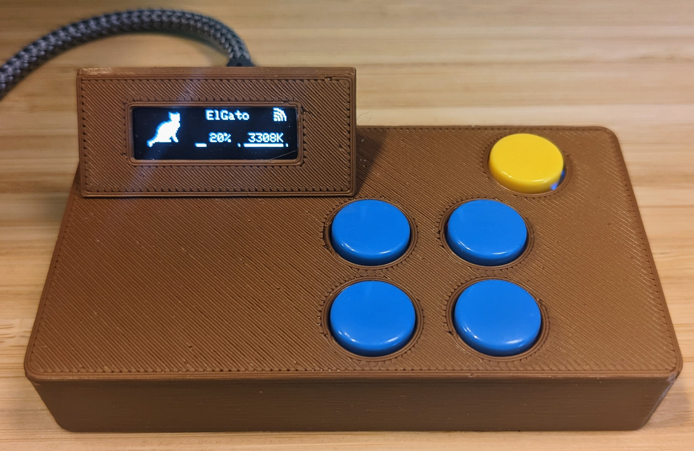
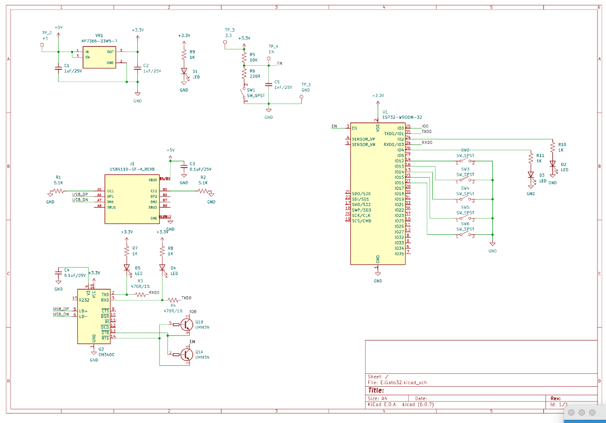
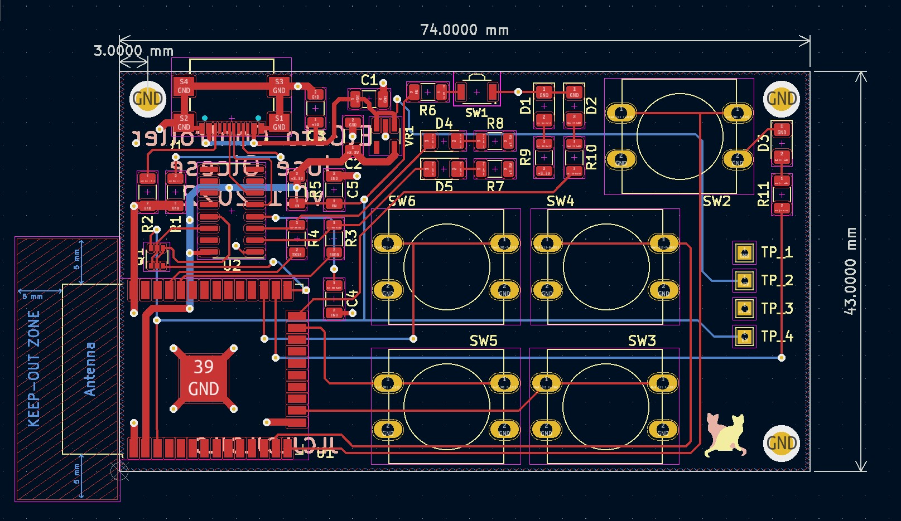

# EL Gato Controller
  

  ## Description
  This is a standalone controller for the ElGato Lights. It's based on an ESP-WROOM-32 module but any ESP32 (or even ESP8266) should work with minimal changes.

  <figure><figcaption>Controller with Display and #d Printed Case</figcaption></figure>

  <figure><figcaption>Schematic for the module, USB-UART controller and buttons</figcaption></figure>

  <figure><figcaption>Display has been added after designing the PCB so no header/connector</figcaption></figure>

  ## Table of Contents
  * [ToDo](#todo)
  * [Installation](#installation)
  * [Usage](#usage)
  * [License](#license)
  * [Contributing](#contributing)
  * [Tests](#tests)
  * [Questions](#questions)

  ## ToDo
  
  - NTP
  - Dynamic lights config/ Web Server
  - Shortcut reboot
  - Brightness
  - Faster REST
  - FIx BAR size
  - ~Wifi Portal~
  - ~OLED Status~
  ## Installation
  Some of the tools used to build this project
  - [Plaftormio](https://platformio.org/)
  - [Kicad](https://www.kicad.org/)
  ## Usage
  Currently, the IPs for both lights are hardcoded. Until I made that discoverable thru Bonjour, numbers of lights and IPs will need to be manually mofified.
  
    main.cpp
    
    const String sLight1 = "192.168.30.137";
    const String sLight2 = "192.168.30.161";

  ## License
  This project is license under MIT

  ## Contributing
  Nothing

  ## Tests
  no tests

  ## Questions
  If you have any questions about this projects, please contact me directly at jolcese@gmail.com. You can view more of my projects at https://github.com/jolcese.